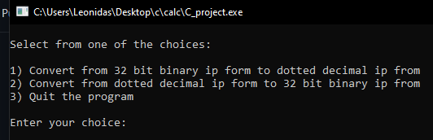

# < IP address convert to binary and vice versa >

## Description 

## Instalation

In order to use our code, someone would need a compiler programm for C language. Few examples are [Dev-C++](https://sourceforge.net/projects/orwelldevcpp/),[Visual Studio Code](https://code.visualstudio.com/download), or can use and online compiler (e.x https://www.programiz.com/c-programming/online-compiler/). 
After having a compiler, next step would be to copy the code and paste it into your compiler.

## Usage

The use of the code is quite easy to follow. There are three options for this project for the user to decide.

 

As you can see, _Option 1_ requires from the user,
firstly to press #1 in order to start that option. After pressing #1 and enter, it will be required to insert a 32 bit binary IP address in order to covert it into decimal form,as displayed in the image bellow.

## Credits

## License 

## Badges

## Tests
