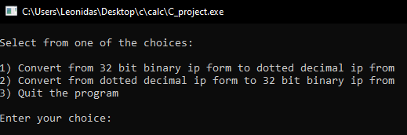

# < IP address convert to binary and vice versa >

## Description 

## Instalation

In order to use our code, someone would need a compiler programm for C language. Few examples are [Dev-C++](https://sourceforge.net/projects/orwelldevcpp/),[Visual Studio Code](https://code.visualstudio.com/download), or can use and online compiler (e.x https://www.programiz.com/c-programming/online-compiler/). 
After having a compiler, next step would be to copy the code and paste it into your compiler.

## Usage

The use of the code is quite easy to follow. There are three options for this project for the user to decide.

 

+ As you can see, _Option 1_ requires from the user,
firstly to press #1 in order to start that option. After pressing #1 and enter, it will be required to insert a 32 bit binary IP address in order to covert it into decimal form,as displayed in the image bellow.

+ The user can insert a binary number as an IP address (we choose a random binary number for the display). The result will be an IP address in decimal form, and the programm will get back to the menu in order to choose another option.

+ Moving on, we can choose _Option 2_ so we can convert the IP address the other way around,meaning from decimal form to binary.As the user chooses _Option 2_ it will be asked from him to enter an IP address in decimal form.The user can insert an IP address in order to convert it into a binary form and back to the menu in order to choose _Option 3_ to terminate the programm.

## Credits

## License 

## Badges

## Tests
